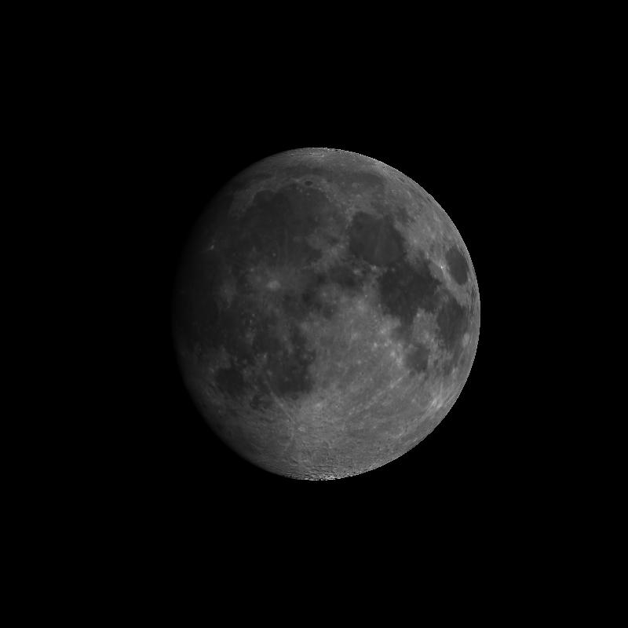

# Lunar calibration with SP model (Disk-resolved model)

This is an official implementation (IDL) of a paper:

"[Development of an application scheme for the SELENE/SP lunar reflectance model for radiometric calibration of hyperspectral and multispectral sensors](https://www.sciencedirect.com/science/article/pii/S0032063315301008)", Kouyama et al., 2016, PSS

for simulating a Moon observation by a 2D imaging sensor from a specific observer position with SP model, which is one of disk-resolved Lunar brightness model and can be used for Lunar calibration for a sensor.

# GDL run example

$ gdl

GDL> .compile main_sp_model.pro

GDL> main_sp_model

# Usage:

**Download the SP model core file**

From https://archive.jlpeda.isas.jaxa.jp/pub/product/moon-selene-sp/sp_cube_ver2011/, download SP model core (hyerspectral data cube).

- 'avg_cube_1000s-7000s_selected_ip110225.img' :: Binary data, Double-precision float, cube data (lon, lat, wavelength)

Then copy this file to "parameters" directory.

**Comfirm paramtere files in this repository**

In this repository (in "parameters" directory):

- 'albedo_group_05x05.dat' :: Binary data, 2byte Integer (lon, lat) = (720, 360)  
Albedo group map (this file is made by Kouyama based on Yokota's definition in Yokota et al 2011)  
Note; Latitude direction (north to south) may be opposit to the SP model definition, sorry..  

- 'High_albedo_sel.txt'  
- 'Mid_albedo_sel.txt'  
- 'Low_albedo_sel.txt'  
ASCII files. Parameters of i, e, alpha dependence for each albedo group.  

- 'Gueymard.txt' :: ASCII file
Solar irradiance data from Gueymard model which is used in generating SP model

**Compile and Run main program**

In IDL/GDL CUI

IDL> .compile main_sp_model.pro

IDL> main_sp_model

All required functions are contained in this repository, and will be compiled automatically at compiling main_sp_model.pro.
(But if you find missed function(s), please inform me)

# Misc:

**Structure of 'avg_cube_1000s-7000s_selected_ip110225.img'**

0.5x0.5 degree grid interval in longitude and latitude direction, and there are 160 channels in wavelength.
i.e. (lon, lat, wavelength) = (720, 360, 160)

  ;; Note: Definition of SP map coordinate  (Lon, Lat)  
  ;; (0.25, 89.75), (0.75, 89.75), ... (359.75,89.75) ;; North pole  
  ;; (0.25, 89.25), (0.75, 89.25), ... (359.75,89.25)  
  ;; ...  
  ;; (0.25, 0.25), (0.75, 0.25), ... (359.75,0.25)  
  ;; (0.25, -0.25), (0.75, -0.25), ... (359.75,-0.25)  
  ;; ...  
  ;; (0.25, -89.25), (0.75, -89.25), ... (359.75,-89.25)  
  ;; (0.25, -89.75), (0.75, -89.75), ... (359.75,-89.75) ;; South pole  

**Installing GDL**

(Ubuntu) $> sudo apt install gnudatalanguage

https://github.com/gnudatalanguage/gdl

# Citations:
- Yokota et al., 2011: Lunar photometric properties at wavelengths 0.5-1.6μm acquired by SELENE Spectral Profiler and their dependency on local albedo and latitudinal zones, Icarus, 215, 639-660

- Ogohara et al., 2012: Automated cloud tracking system for the Akatsuki Venus Climate Orbiter data, Icarus, 217, 661-668

- Kouyama et al., 2016: Development of an application scheme for the SELENE/SP lunar reflectance model for radiometric calibration of hyperspectral and multispectral sensors, Planet. Space Sci., 124, 76-83

# Contact
Toru Kouyama (AIST), 2019.04.29, modified 2020.10.12, 11.16, 2023.08.16
